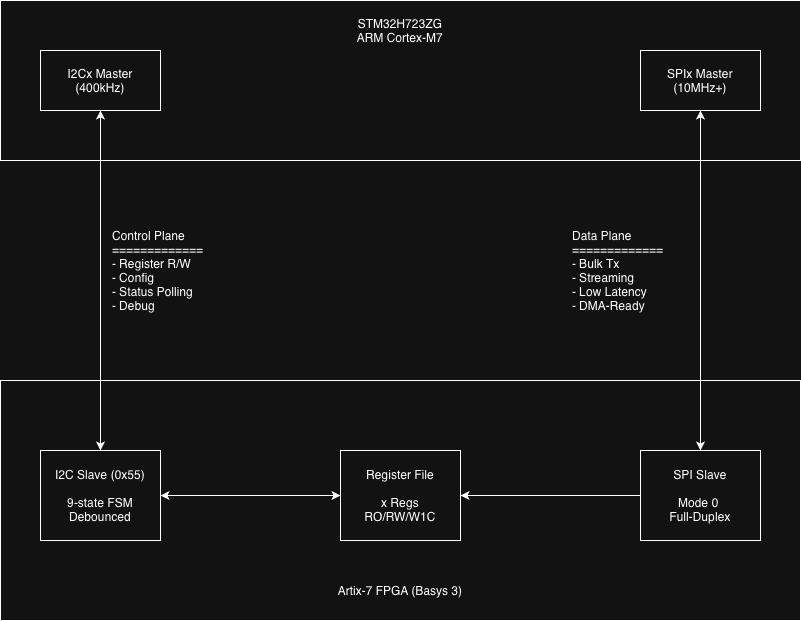

# STM32 H7 + Artix-7 FPGA Co-Processing System

**Heterogeneous computing bridge for offloading high-speed I/O and DSP tasks from a Nucleo-H723ZG to a Basys 3 FPGA.**

## **Overview**
This project implements a dual-plane communication architecture separating control operations (I2C) from high-speed data transfer (SPI), enabling efficient MCU-FPGA co-processing.

| Plane | Interface | Speed | Purpose |
|-------|-----------|-------|---------|
| Control | I2C | 400kHz | Register config, status, diagnostics |
| Data | SPI + DMA | 15.6 MHz | Bulk streaming, real-time data |

## **Link Characterization Results**
Full characterization completed with the following results:

| Metric | Result | Notes |
|--------|--------|-------|
| I2C Write Latency | 85 us avg | <1% variance |
| I2C Read Latency | 118 us avg | 100% success rate |
| SPI Throughput | 481 KB/s (polling) | 64-byte burst |
| SPI Throughput | 460 KB/s (DMA) | Circular mode |
| Bit Error Rate | 0.00% | 1MB+ transferred |
| Concurrent Ops | 142768 x 2 | Zero errors over 30s | 

### Clock Configuration

```
SYSCLK:     500 MHz
HCLK:       250 MHz  
APB2:       125 MHz
SPI4 Clk:   125 MHz (kernel clock)
SPI Speed:  15.625 MHz (/8 prescaler) -> Default
```

## Hardware Constraints
### Breadboard Wiring Limits
Current prototype using less than ideal long jumper wires, likely limiting SPI speed:

| Prescaler | SPI Clock | Status | Notes |
|-----------|-----------|--------|-------|
| /16 | 7.8 MHz | Stable | Conservative, guarenteed reliability |
| /8 | 15.6 MHz | Default | - |
| /4 | 31.25 MHz | Faile | Signal integrity issues |

**Root Cause:** Breadboard parasitic capacitance (5-10pF) and wire inducatance cause signal degradation at higher frequencies.

**Improvements:** Use controlled-impeance traces via PCB or even shorted breadboard jumpers would likely resolve the issue.

## Quick Start 
### 1. Flash FPGA
```make
cd ../fpga/scripts
make program
```

### 2. Build Firmware
```bash 
# In STM32CubeIDE or via command line
# Set APP_TEST_MODE in app_config.h:
#   TEST_MODE_NORMAL      - Standard operation
#   TEST_MODE_LINK_CHAR   - Run characterization suite
```

### 3. Run Link Charactrization
```c
// In app_config.h
#define APP_TEST_MODE  TEST_MODE_LINK_CHAR
```
Connect SWV to view results <br>

## Architecture


## Verification
```bash
cd fpga/sim
make verify  # run full regression
make wave
```


