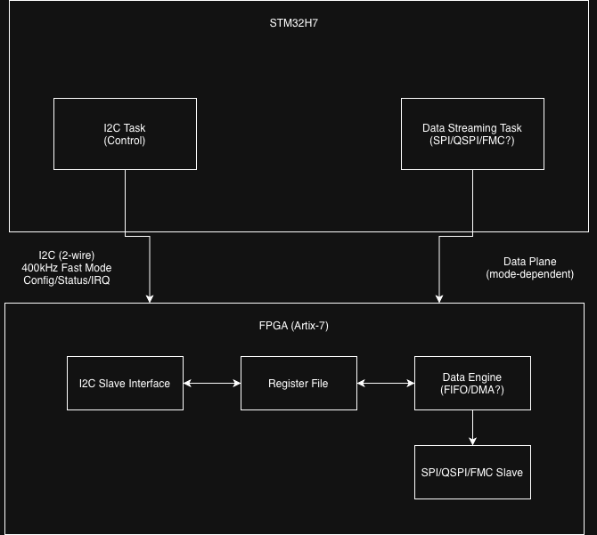

# STM32 H7 + Artix-7 FPGA Co-Processing System

## Overview
High-speed, real-time co-processing bridge between a __Nucleo-H723ZG__ and a __Basys 3 (Artix-7 FPGA)__. This project demonstrates heterogeneous computing by offloading low-level I/O and acceleration tasks to the FPGA while maintaining high-level control on the MCU via __FreeRTOS__.

Unlike typical MCU-FPGA designs that treat the FPGA as a fixed accelerator, this system explores runtime-configurable offloading, enabling dynamic tradeoffs between latency, bandwidth, and compute density.

## Research Focus: __Hardware Offloading Feasibility__
**Note:** *This project is in development as a research testbed.*
The architecture is designed to investigate workloads where __computational density outweighs bus latency__. Current candidate applications include:

1. __Inline Security & Storage:__
    - Transparent AES-256 encryption and LZ4 compression for high-speed data logging.
2. __Digital Signal Processing (DSP):__
    - Offloading high-order filtering and FFTs to free up MCU cycles for application logic.
3. __Edge AI Accleration__
4. __Protocol Bridging:__
    - Using FPGA as a "Smart PHY" to interface the STM32 with high-speed ADCs or legacy buses requiring strict timing.

__Key Features:__
* __Dual-Bus Architecture:__ Separate control (I2C) and data (SPI/QSPI/FMC) planes.
* __Adaptive Link:__ Runtime-configurable data plane supporting 1-100+ MB/s throughput scaling.
* __DMA-Accelerated SPI:__ Non-blocking, full-duplex communication using STM32 DMA controllers.
* __Robust PHY Layer:__ SPI Mode 1 with custom shift guard logic ensuring data integrity.
* __CDC (Clock Domain Crossing):__ 3-stage synchronization bridging asynchronous SPI and 100MHz FPGA domains.

## Architecture

## Repository Structure
* `firmware/`: STM32CubeIDE project (C, FreeRTOS, HAL) - **Control & Data Plane Implemented**
* `fpga/`: Vivado 2025.2 project (SystemVerilog)
* `docs/`: Technical documentation
* `tools/`: Scripts and utilities

## Hardware Setup

__Control Plane (I2C):__
| Signal | STM32 | FPGA (Basys 3) |
|--------|-------|----------------|
| I2C SCL | PB6 | JB1 |
| I2C SDA | PB7 | JB2 |

__Data Plane (SPI):__
| Signal | STM32 | FPGA (Basys 3) |
|--------|-------|----------------|
| CS | PE4 | JA1 |
| SCLK | PE2 | JA4 |
| MOSI | PE6 | JA3 |
| MISO | PE5 | JA2 |

## Primitive Offload Model (Compute vs Offload)
    - Time on: T_mcu ~= (bytes_in * ops_per_byte) / MCU_ops_per_second
    - Time offload: T_offload ~= (bytes_in / B_in ) + setup_latency + (bytes_out / B_out) + (bytes_in * ops_per_byte) / FPGA_ops_per_second
        - B_in is the effective bandwidth from MCU to FPGA
        - B_out is the effective bandwidth from FPGA back to MCU.
    - Offload is justified when T_offload < T_mcu (ideally T_offload << T_mcu due to config complexity) by an adequate margin. Ops_per_byte is dependent on algorithm choice and precision, B_in/B_out is dependent on the interface chosen and DMA configuration, setup_latency is dependent on batching/descriptor queues, and FPGA_ops_per_second is dependent on the designed FPGA pipeline/parallelization.
 
## Roadmap

- [x] __Phase 1: Physical Layer (PHY) & Validation__
    - [x] SPI Master (STM32) ↔ Slave (FPGA) link
    - [x] CDC synchronization for stable data latching
    - [x] DMA integration (circular buffers)
    - [x] Stability fix: SPI Mode 1 + FPGA shift guards
    - [x] Verified 0% BER on 64-byte burst packets

- [ ] __Phase 2: Dual-Bus Architecture__
    - [x] __Firmware:__ I2C Control Plane Driver (`fpga_link.c`)
    - [x] __Firmware:__ FreeRTOS Task Separation (Control vs Data)
    - [x] __Firmware:__ Clean compilation & Linker resolution
    - [ ] __Hardware:__ Validate I2C Register Read/Write (Stage 2 Validation)
    - [ ] Runtime data plane mode switching

- [ ] __Phase 3: Bandwidth Scaling__
    - [ ] Dynamic SPI clock configuration
    - [ ] QSPI data plane (4-wire, 25+ MB/s)
    - [ ] FMC parallel interface (100+ MB/s)

- [ ] __Phase 4: Research & Applications__
    - [ ] Investigation: AES-256 Core on Artix-7
    - [ ] Investigation: LZ4 Compression throughput

## Getting Started
1. __FPGA:__ Open `fpga/` in Vivado, generate bitstream, program board
2. __Firmware:__ Open `firmware/` in STM32CubeIDE, build and flash
3. __Hardware:__ Connect I2C and SPI lines per tables above
4. __Verify:__ Check SWV console for "FPGA Link Active"

---
*See [docs/dev_log.md](docs/dev_log.md) for detailed implementation notes.*
