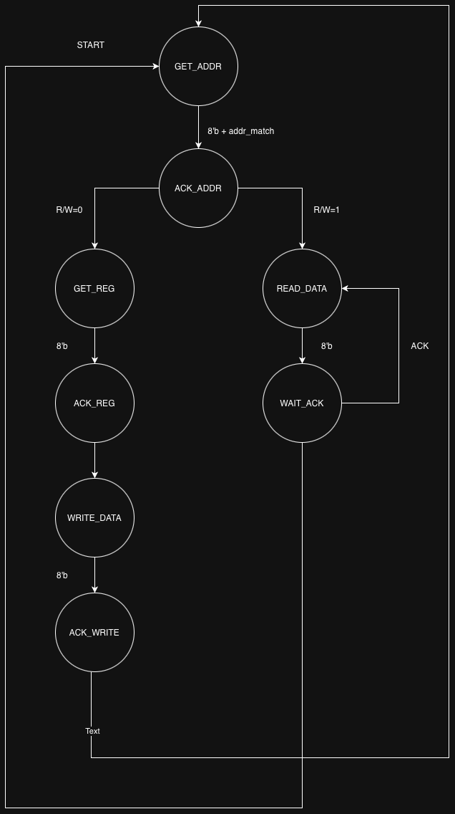
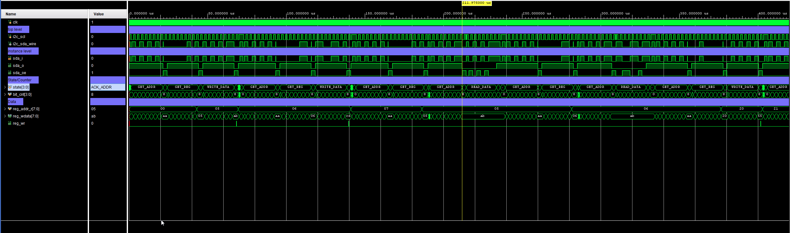
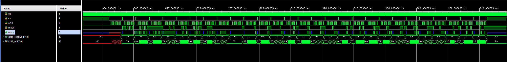
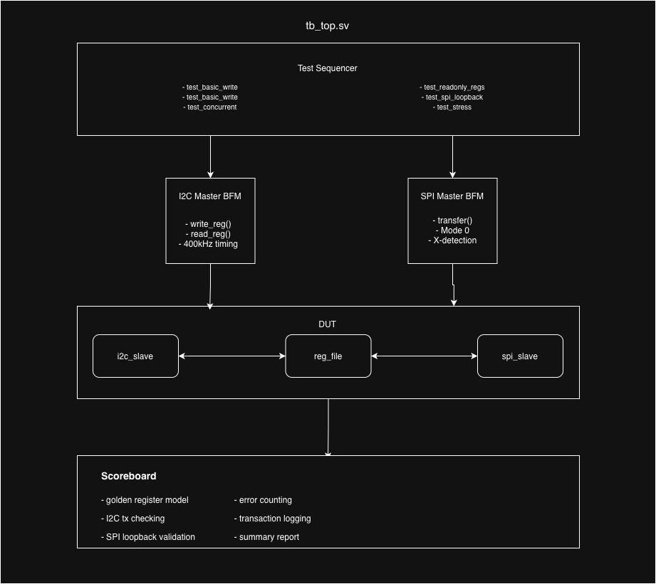
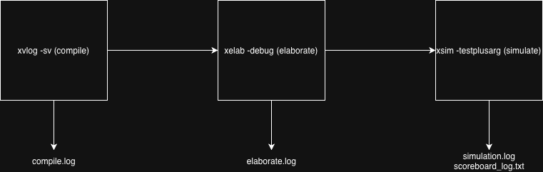

# STM32 - FPGA Communcation Bridge

## Technical Design Report

**Project:** Dual-Plane MCU-FPGA Communication System
**Platform:** STM32H723ZG + Xilinx Aritx-7 (Basys 3)
**Author:** Trey Parker
**Date:** 1/30/2026
**Revision:** 2.0
**Status:** Verification Complete

## Table of Contents

1. Summary
2. System Architecture
3. RTL Implementation
4. Verification Environment
5. Test Results
6. Build & Automation
7. Next Steps: Core IP Development


## 1. Summary
This project implements a dual-plane communication architecture between an STM32H723ZG microcontroller and an Artix-7 FPGA, separating control operations (I2C) from high-speed data transfer (SPI).

### Key Results

| Metric |  Result |
|--------|---------|
| I2C Control Plane | 100% Pass Rate |
| SPI Data Splane | 0% BER |
| Simulation Coverage | 147 transactions, 99.3% pass rate |
| Verification Environment | BFM + Scoreboard architecture |

### Acheivements
* [x] Full I2C slav state machin with debounce filetring and open-drain support
* [x] SPI slave ith loopback verification mode, need to develop come core IP
* [x] Memory-mapped register file with RO/RW/W1C access types
* [x] SystmVerilog verification environment with golden model checking
* [x] Cross platform build automation (windows/linux)
* [x] Identified and resolved I2C read timing bug via systematic debugging

## 2. System Architecture
### 2.1 Dual-Plane Philosophy
The architecture seperates communication into 2 independent planes, each optimized for its specific use case:


### 2.2 Design Rational
| Aspect | I2C Control Plane | SPI Data Plane |
|--------|-------------------|----------------|
| Purpose | Config, status | Bulk data tx |
| Speed | 400kHz (Fast Mode) | 10-50MHz |
| Protocol | Address-based registers | Streaming/packet |
| Overhead | higher due to addressing | minimal |
| Complexity | 9-state FSM | shift register |
| Use Case | Setup, polling, debug | Real-time data |

### 2.3 Hardware Platform

**MCU: STM32H723ZG (Nucleo-H723ZG)**

* ARM Cortex-M7
* FreeRTOS for task management
* HAL drivers with DMA support
* FPGA API
* I2C1 (PB6/PB7) + SPI4 (PE2/PE4/P5/PE6/)

**FPGA: Xilinx Artix-7 (Basys 3)**

* xc7a35tcpg236-1 with 33,280 logic cells
* 100MHz system clock from on-board oscillator
* Pmod JA/JB for SPI/I2C routing

## 3. RTL Implementation
### 3.1 Module Hierarchy

* fpga/rtl/
    * top.sv
    * bus/
        * i2c_slave.sv
        * i2c_debounce.sv
        * spi_slave.sv
    * core/
        * register_file.sv
    * io/
        * seven_seg.sv

### 3.2 I2C Slave Implementation
**File:** [rtl/bus/i2c_slave.sv](../fpga/rtl/bus/i2c_slave.sv)
**Protocol:** I2C Fast Mode (400kHz), 7-bit addressing
**Slave Address:** 0x55 (parameterized)

**State Machine**


**Features**
| Feature | Implementation |
|---------|----------------|
| Debounce Filter | 0.1us glitch rejection via `i2c_debounce.sv` |
| Edge Detection | Registered SCL/SDA with clean R/F detection |
| Open-Drain | Seperate `sda_o` and `sda_oe` for bidirectional bus |



### 3.3 SPI Slave Implementation
**File:** [rtl/bus/spi_slave.sv](../fpga/rtl/bus/spi_slave.sv)
**Protocol:** SPI Mode 0 (CPOL=0, CPHA-0)
**Mode:** Loopback (Tx[n] = Rx[n-1])

**Key Features**
* **Redundant 3-stage Synchronizer** for SCL, CS, MOSI (metastability protection)
* **Loopback mode for verification:** `Tx[n] = Rx[n-1]`
* **High-Z MISO** when CS inactive



### 3.4 Register file
**Address Map:** See [register_map/csv](../fpga/sim/register_map.csv)

**Access Types:**
* **RO (Read-Only):** Hardware-defined values, writes ignored
* **RW (Read-Write):** Software-controlled registers
* **W1C (Write-1-to-clear):** Write 1 to clear bits (e.g flags)

## 4. Verification Environement

### 4.1 Architecture


### 4.2 Directory Structure
```shell
fpga/sim/
    Makefile                    # cross platofrm build automation
    tb_top.sv   
    register_map.csv            # register defs
    
    pkg/
        tb_pkg.sv               # classes, constants, utilities

    bfm/
        i2c_master_bfm.sv       # i2c protocol model
        spi_master_bfm.sv       # spi protocol model

    common/
        scoreboard.sv           # golden model
        test_base.sv            # test infrastructure

    tests/
        i2c_tests/
            test_basic_write.sv
            test_basic_read.sv
        spi_tests/
            test_loopback.sv
        integration_tests/
            test_concurrent.sv

    build/
        # comp artifacts
```

### 4.3 Bus Functional Models

**I2C Master BFM ([i2c_master_bfm.sv](../fpga/sim/bfm/i2c_master_bfm.sv))**
| Feature | Details |
|---------|---------|
| Protocol | Full I2C: START, STOP, Rep'd Start |
| Timing | Configurable, default 400kHz @ 100MHz reference |
| ACK Handling | Automatic with error reporting |
| API | `write_reg(addr,data)`, `read_reg(addr,data)` |
| States | 14-state FSM |

**SPI Master BFM ([spi_master_bfm.sv](../fpga/sim/bfm/spi_master_bfm.sv))**
| Feature | Details |
|---------|---------|
| Protocol | SPI Mode 0 |
| Clock | Configurable Divider |
| Operation | Full-duplex |
| Error Detection | X-state sampling with messaging |

### 4.4 Scoreboard
The scoreboard maintains a golden model of the register file

### 4.5 Test Package ([tb_pkg.sv](../fpga/sim/pkg/tb_pkg.sv))
Provides shared definitions:
* **Transaction Classes:** `i2c_transaction`, `spi_transaction` with randomization
* **Register Constants:** Matching RTL addr defs
* **Utility Functions:** `is_writeable_reg()`, `is_readonly_reg()`
* **Statistics Class:** Pass/Fail counting with formatting

## 5. Test Results
### 5.1 Test Summary

```powershell
[SCOREBOARD] ============ Final Summary ============
[SCOREBOARD] I2C Transactions: 119
[SCOREBOARD] SPI Transactions: 28
[SCOREBOARD] Total Errors:     1
[SCOREBOARD] =========================================
```

### 5.2 Test Note(s)
First SPI transfer returns X (expected, no data in shift register)

## 6. Build & Automation
### 6.1 Tool Flow


## 7. Next Steps: Core IP Development
### 7.1 Possible Enhancements
| Enhancment | Description |
|------------|-------------|
| DMA Descriptors | Add descriptor-based DMA for autonomous transfers |
| Command protocol | Define packet structure for SPI data plane |
| Hardware CRC | CRC-8/16 for integrity |
| Interrupt Support | IRQ pin for event notification |
| QSPI Support | 4-bit data path for higher throughput |