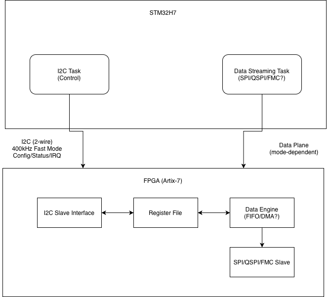

# __Adaptive Link Architecture Specification__
__Version:__ 0.1
__Date:__ 01/14/2026
__Status:__ Design Phase

## 1. Overview

### 1.1 Purpose
The documentation specs a runtime-configurable communication interface between the STM32H7 MCU and Artix-7 FPGA. Enabling dynamic negotiation of link parameters (clock speed, bus width, interface type) to scale bandwidth from ~1MB/s to 100+MB/s based on application requirements.

### 1.2 Design philosophy
The system seperats the control and data plane:

| Plane | Interface | Role | Bandwaidth (assumed) |
|-------|-----------|------|----------------------|
| Control | I2C (2 wire) | Config, status, negotiation | ~100KB/s |
| Data | SPI/QSPI/FMC | Bulk transfers, streaming | 1-100+ MB/s |

By isolating control traffic, the data plane becomes a pure streaming interface with zero protocol overhead.

### 1.3 Key Features
* __Physical seperation:__ Control (I2C) and data (SPI/QSPI/FMC) on independent buses
* __Standard protocol:__ I2C reg. access is standard in industry
* __Capability discovery:__ MCU queies FPGA for supported data plane modes
* __Hot-reconfig:__ Data plane mode changes via I2C w/o reset
* __Debug:__ Control & Data are distinguishable

## 2. System Architecture

### 2.1 Block Diagram

