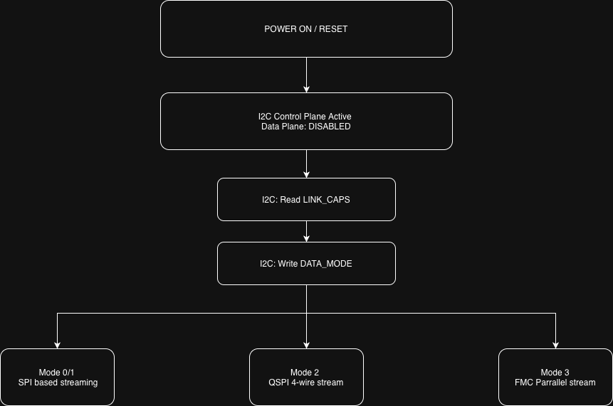
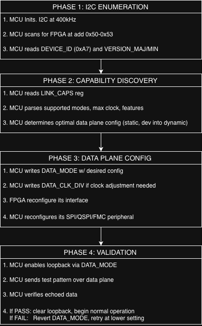
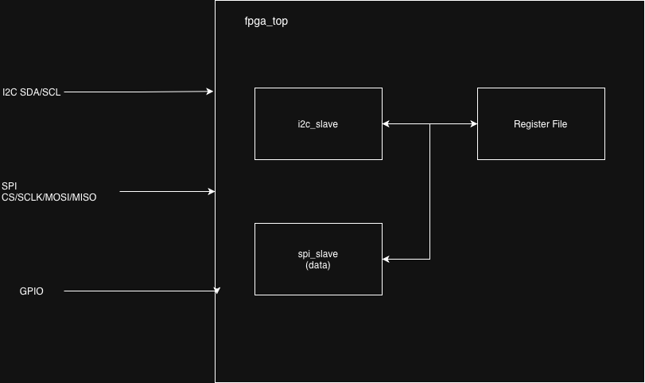

# __Adaptive Link Architecture Specification__
__Version:__ 0.3
__Date:__ 01/19/2026
__Status:__ Design Phase

## 1. Overview

### 1.1 Purpose
The documentation specs a runtime-configurable communication interface between the STM32H7 MCU and Artix-7 FPGA. Enabling dynamic negotiation of link parameters (clock speed, bus width, interface type) to scale bandwidth from ~1MB/s to 100+MB/s based on application requirements.

### 1.2 Design philosophy
The system seperats the control and data plane:

| Plane | Interface | Role | Bandwaidth (assumed) |
|-------|-----------|------|----------------------|
| Control | I2C (2 wire) | Config, status, negotiation | ~100KB/s |
| Data | SPI/QSPI/FMC | Bulk transfers, streaming | 1-100+ MB/s |

By isolating control traffic, the data plane becomes a pure streaming interface with zero protocol overhead.

### 1.3 Key Features
* __Physical seperation:__ Control (I2C) and data (SPI/QSPI/FMC) on independent buses
* __Standard protocol:__ I2C reg. access is standard in industry
* __Capability discovery:__ MCU queies FPGA for supported data plane modes
* __Hot-reconfig:__ Data plane mode changes via I2C w/o reset
* __Debug:__ Control & Data are distinguishable

## 2. System Architecture

### 2.1 Block Diagram


### 2.2 Data Plane Modes
Data plane interface is selected via I2C config.

| Mode | Interface | Clock | Width | Throughput (est) | Use Case |
|------|-----------|-------|-------|------------------|----------|
| 0 | SPI | 1-10MHz | 1'b | ~1MB/s | Basic, default |
| 1 | SPI | 10-25MHz | 1'b | ~3MB/s | Standard operation |
| 2 | QSPI | 25-50MHz | 4'b | ~25MB/s | High throughput |
| 3 | FMC | 50-100MHz | 16'b | ~100MB/s | Maximum Bandwidth |

### 2.3 Mode Tranistion Diagram


### 2.4 Interface Responsibilities
| Interface | Responsibilities | Never Does |
|-----------|------------------|------------|
| I2C | Reg. R/W, mode config, status poll, IRQ handling | Bulk data transfer |
| Data Plane | Raw byte streaming, DMA transfers | Command parsing, protocol framing |

## 3. Control Plane Protocol (I2C)

### 3.1 I2C Configuration
| Parameter | Value | Notes |
| Mode | Fast Mode (400kHz) | Ensure stability |
| Addressing | 7'b | Default: 0x50 |
| Clock Stretch | Supported | FPGA may hold SCL during register access? |

### 3.2 I2C Slave Address 
The FPGA I2C slave address can be configured via dedicated pins:
| A1 | A0 | Address |
|----|----|---------|
| 0 | 0 | 0x50 |
| 0 | 1 | 0x51 |
| 1 | 0 | 0x52 |
| 1 | 1 | 0x53 |

### 3.3 Register Access Protocol
__1'B Write:__
START - ADDR+W - ACK - REG - ACK - DATA - ACK - STOP

__1'B Read:__
START - ADDR+W - ACK - REG - ACK - STORE - ADDR+R - ACK - DATA - NACK - STOP

__Multi-Byte Write (auto-increment):__
STOP ─ ADDR+W ─ ACK ─ REG ─ ACK ─ DATA0 ─ ACK ─ DATA1 ─ ACK ─ ... ─ STOP

__Multi-Byte Read (auto-increment):__
START ─ ADDR+W ─ ACK ─ REG ─ ACK ─ STORE ─ ADDR+R ─ ACK ─ DATA0 ─ ACK ─ DATA1 ─ ACK ─ ... ─ NACK ─ STOP

### 3.4 Register Auto-Incrment
The register pointr auto-increments after each byte, enabling efficient block transfers:
```c++
// STM32: Read 4'B starting at register 0x10
uint8_t buf[4];
HAL_I2C_Mem_Read(&hi2c1, FPGA_ADDR, 0x10, I@C_MEMADD_SIZE_8BIT, buf, 4, 100);   // NOTE: may not be on i2c ch 1 depending on perip avail.
// Returns: REG[0x10], REG[0x11], REG[0x12], REG[0x13]
```

### 3.5 Error Handling
| Condition | FPGA Response |
|-----------|---------------|
| invalid register address | NACK on reg byte |
| write to read only reg | ACK but ignore |
| undefined register read | Returns 0x00 |

## 4. Register Map
### 4.1 Register Overview
| Range | Block | Description |
|-------|-------|-------------|
| 0x00-0x0F | System | ID, version, status, test |
| 0x10-0x1F | Link Control | Data plane mode, capabilities |
| 0x20-0x2F | GPIO | LED, switch, user I/O |
| 0x30-0x3F | Data Engine | FIFO status, DMA config. |
| 0x40-0xFF | Reserved | Expansion |

### 4.2 System Registers (0x00-0x0F)
| Addr | Name | R/W | Reset | Description |
|------|------|-----|-------|-------------|
| 0x00 | DEVICE_ID | R | 0xA7 | Device identifier |
| 0x01 | VERSION_MAJ | R | 0x01 | Firmware major version |
| 0x02 | VERSION_MIN | R | 0x00 | Firmware minor version |
| 0x03 | SYS_STATUS | R | 0x01 | System status flags |
| 0x04 | SYS_CTRL | R/W | 0x00 | System control |
| 0x05 | SCRATCH0 | R/W | 0x00 | Test reg. 0 |
| 0x06 | SCRATCH1 | R/W | 0x00 | Test reg. 1 |
| 0x07-0x0F | RESERVED | - | 0x00 | - |

#### SYS_STATUS (0x03):
bit 7   - I2C ready <br>
bit 6   - Data plane ready <br>
bit 5   - Error flag (sticky, must write 1 to clear) <br>
bit 4   - IRQ pending <br>
bit 3:0 - RESERVED <br>

### 4.3 Link Control Registers (0x10-0x1F)
| Addr | Name | R/W | Reset | Description |
|------|------|-----|-------|-------------|
| 0x10 | LINK_CAPS | R | * | Data plane capability flags |
| 0x11 | DATA_MODE | R/W | 0x00 | Active data plane mode (0-3) |
| 0x12 | DATA_CLK_DIV | R/W | 0x04 | Data plane clock divisor |
| 0x13 | DATA_STATUS | R | 0x00 | Data plane health |
| 0x14 | DATA_ERR_CNT | R | 0x00 | Error counter (clears on read) |
| 0x15 | DATA_TEST | R/W | 0x00 | Test pattern trigger |
| 0x17-0x1F | RESERVED | - | 0x00 | - |

#### LINK_CAPS (0x10)
bit 7:6 -   Max bus width <br>
            00 = 1'b -> SPI  <br>
            01 = 2'b -> DUAL SPI <br>
            10 = 4'b -> QSPI <br>
            11 = 8'b -> FMI <br>

bit 5:4 -   Max clock tier <br>
            00 = 10MH <br>
            01 = 25MHz <br>
            10 = 50MHz <br>
            11 = 100MHz <br>

bit 3   -   FMC interface available <br>
bit 2   -   DMA streaming supported <br>
bit 1   -   Hardware CRC available <br>
bit 0   -   IRQ output available <br>

#### DATA_MODE (0x11)
bit 7   -   Enable data plane <br>
bit 6   -   Loopback mode (testing/debug) <br>
bit 5:4 -   RESERVED <br>
bit 3:2 -   Bus width (00=1, 01=2, 10=4, 11=8) <br>
bit 1:0 -   Mode select (00=SPI, 01=SPI-HI, 10=QSPI, 11=FMC) <br>

### 4.4 GPIO Registers (0x20-0x2F)
| Addr | Name | R/W | Reset | Description |
|------|------|-----|-------|-------------|
| 0x20 | LED_OUT | R/W | 0x00 | LED[7:0] output |
| 0x21 | LED_OUT_H | R/W | 0x00 | LED[15:8] output |
| 0x22 | SW_IN | R | - | Switch[7:0] input |
| 0x23 | SW_IN_HI | R | - | Switch[15:8] input |
| 0x24 | SEG_DATA | R/W | 0x00 | 7-segment display data |
| 0x25 | SEG_CTRL | R/W | 0x00 | 7-segment control |

### Data Engine Registers (0x30-0x3F)
| Addr | Name | R/W | Reset | Description |
|------|------|-----|-------|-------------|
| 0x30 | FIFO_STATUS | R | 0x00 | TX/RX FIFO status |
| 0x31 | FIFO_TX_LVL | R | 0x00 | TX FIFO fill level |
| 0x32 | FIFO_RX_LVL | R | 0x00 | RX FIFO fill level |
| 0x33 | FIFO_CTRL | R/W | 0x00 | FIFO control (flush, enable) |

#### FIFO_STATUS (0x30)
bit 7   - TX FIFO full  <br>
bit 6   - TX FIFO empty <br>
bit 5   - TX FIFO half <br>
bit 4   - RX FIFO full <br>
bit 3   - RX FIFO empty <br>
bit 2   - RX FIFO half <br>
bit 1   - Overflow error <br>
bit 0   - underflow error <br>

## 5. Initialization & Mode Configuration
### 5.1 Boot Sequence


### 5.2 STM32 Initialization Code [DRAFT]
```c
#define FPGA_I2C_ADDR   0x50 <br>

typedef struct {
    uint8_t device_id;
    uint8_t version_maj;
    uint8_t version_min;
    uint8_t link_caps;
} fpga_info_t;

HAL_StatusTypeDef fpga_init(I2C_HandleTypeDef *hi2c, fpga_info_t *info) {
    // Phase 1: Enumerate
    if (HAL_I2C_Mem_Read(hi2c, FPGA_I2C_ADDR << 1, 0x00, 
            I2C_MEMADD_SIZE_8BIT, &info->device_id, 1, 100) != HAL_OK) {
        return HAL_ERROR;  // FPGA not found
    }
    
    if (info->device_id != 0xA7) {
        return HAL_ERROR;  // Wrong device
    }
    
    // Read version
    HAL_I2C_Mem_Read(hi2c, FPGA_I2C_ADDR << 1, 0x01, I2C_MEMADD_SIZE_8BIT, &info->version_maj, 1, 100);
    HAL_I2C_Mem_Read(hi2c, FPGA_I2C_ADDR << 1, 0x02, I2C_MEMADD_SIZE_8BIT, &info->version_min, 1, 100);
    
    // Phase 2: Get capabilities
    HAL_I2C_Mem_Read(hi2c, FPGA_I2C_ADDR << 1, 0x10, I2C_MEMADD_SIZE_8BIT, &info->link_caps, 1, 100);
    
    return HAL_OK;
}

HAL_StatusTypeDef fpga_set_data_mode(I2C_HandleTypeDef *hi2c, uint8_t mode) {
    uint8_t data_mode = 0x80 | mode;  // Enable + mode
    return HAL_I2C_Mem_Write(hi2c, FPGA_I2C_ADDR << 1, 0x11,I2C_MEMADD_SIZE_8BIT, &data_mode, 1, 100);
}  
```

### 5.3 Runtime Mode Switching
Mode changes can occur at runtime without reset:
```c
// Switch from SPI to QSPI
fpga_set_data_mode(&hi2c1, 0x02);  // Mode 2 = QSPI

// Wait for FPGA to reconfigure
HAL_Delay(1);

// Reconfigure STM32 OCTOSPI peripheral
MX_OCTOSPI1_Init_QSPI();  // User-defined reconfig function
```

## 6. Implementation Plan
| Phase | Scope | Interface | Deliverable |
|-------|-------|-----------|-------------|
| A | I2C & Reg file | I2C only | Basic R/W working |
| B | System & GPIO regs | I2C | LED control via I2C |
| C | Link control regs | I2C | LINK_CAPS query |
| D | SPI data plane (extend) | I2C + SPI | Streaming & config |
| E | Dynamic SPI clock | I2C + SPI | Runtime clock change |
| F | QSPI datapath | I2C + QSPI | 4-wire streaming |
| G | FMC interface | I2C + FMC | Parallel data plane |

## 7. FPGA Module Design
### 7.1 Top-Level Block Diagram


### 7.2 Module Hierarchy
fpga_top
- i2c_slave         # I2C slave interface
    - i2c_bit_ctrl  # SDA/SCL bit-level control
    - i2c_byte_ctrl # Byt assembly, ACK/NACK
- register_file     # Central register bank
    - sys_regs      # 0x00-0x0F
    - link_regs     # 0x10-0x1F
    - gpio_regs     # 0x20-0x2F
    - fifo_regs     # 0x30-0x3F
- spi_slave         # SPI data plane (existing)
    - led_driver    
    - seg7_driver

### 7.3 I2C Slave FSM

See [state_machines.md](state_machines.md) for detailed FSM documentation.

__Verification:__ See [i2c_validation.md](protocols/I2C/i2c_validation.md)

## 8. Hardware Configuration
### 8.1 Pin Mapping
| Bus | Signal | STM32H723 | Basys 3 FPGA | Notes |
|-----|--------|-----------|--------------|-------|
| I2C | SCL | PB6(I2C1_SCL) | JB1(A14) | 4.7k Pull-up |
| I2C | SDA | PB7(I2C1_SDA) | JB2(A16) | 4.7k Pull-up |
| SPI | CS | PE4(SPI_CS) | JA1(J1) | Active low |
| SPI | MOSI | PE6(SPI4_MOSI) | JA2(L2) | - |
| SPI | MISO | PE5(SPI4_MISO) | JA3(J2) | - |
| SPI | SCLK | PE2(SPI4_SCK) | JA4(G2) | Mode 1 (CPOL=0, CPHA=1) |

### 8.2 STM32 Peripheral Configuration

```
I2C1:
    - Mode: Fast Mode (400kHz)
    - Rise Time: 100ns
    - Fall Time: 10ns
    - Analog Filter: Enabled
    - Digital Filter: 0

SPI4:
    - Mode: Full-Duplex Master
    - Data Size: 8'b
    - CPOL: Low
    - CPHA: 2 Edge (Mode 1)
    - NSS: Software
```

## 9. Firmware Implementation
### 9.1 Overview
The STM32 firmwawre uses a layered architecture on FreeRTOS to ensure seperation of concerns between the slow Control Plan and the real-time (hopefully hard-time) data plane. <br>

### 9.2 Driver Model
1. __Low-Level Driver ([fpga_link.c](firmware/STM32_FPGA_Bridge/Drivers/FPGA/src/fpga_link.c)):__
    - __Abstracts HAL I2C calls (to be moved to DMA).__
    - Provides atomic `fpga_read_reg` / `fpga_write_reg` primitives.
    - Handles endianness and timeouts
2. __Control Task ([fpga_ctrl_task.c](firmware/STM32_FPGA_Bridge/Core/Src/fpga_ctrl_task.c)):__
    - __Priority:__ Normal
    - __Role:__ System Supervisor
    - __Functions:__ Handles initialization, periodic status polling (10Hz), and error logging.
3. __Data Task ([fpga_spi_task.c](firmware/STM32_FPGA_Bridge/Core/Src/fpga_ctrl_task.c)):__
    - __Priority:__ High/Real-time (Normal currently for HW test)
    - __Role:__ Bulk data mover.
    - __Functions:__ Manages SPI DMA circular buffers. Calculates throughput and validates data integrity.
4. __Memory Management:__
    - DMA buffers are stricly placed in (__non-cacheable__) __D2 SRAM__.
    - MPU is configured too treat SRAM as _Non-cacheable_ to prevent Cortex-M7 D-Cache coherency issues during DMA transfers.

### 9.3 Test Modes
The firmware supports compile-time test configurations vis [app_config.h](firmware/STM32_FPGA_Bridge/Core/Inc/app_config.h):
* `TEST_MODE_I2C_ONLY`: Disables SPI task; loops I2C LED toggles.
* `TEST_MODE_SPI_ONLY`: Disables I2C polling; streams SPI data continuously.
* `TEST_MODE_STRESS`: Runs both planes concurrently to test bus arbitration and noise immunity.

            
# Revision History 
| Version | Date | Author | Changes |
|---------|------|--------|---------|
| 0.1 | 2026-01-14 | Trey P. | Architecture Draft |
| 0.2 | 2026-01-18 | Trey P. | I2C FPGA Update |
| 0.3 | 2026-01-19 | Trey P. | Firmware details |
