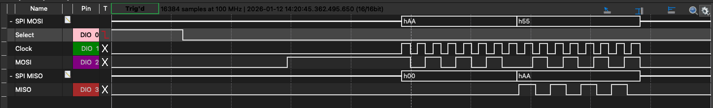

# Phase 1: Physical Layer Verification Report

__Status:__ Verified
__Date:__ 01/12/2026
__File(s):__ 'tb_spi_slave.sv'

## BASELINE
### 1. Summary
Phase 1 focused on establishing a robust SPI Slave interface on the Artix-7 FPGA (Basys 3). Verification confirmed correct Clock Domain Crossing (CDC) from the asynchronous SPI Clock (Target: 3.91MHz) to the FPGA System Clock (100MHz).

__Result:__ Passed all functional burst tests with zero timing violations.

## 2. Hardware Performance Metrics
Metrics re-calculated based on the confirmed MCU SPI Baud Rate of 3.906MHz and logic analyzer time stamps.

Metric | Measured / Calculated | Description
--- | --- | --- 
Oversampling Ratio | 25.6x | 100MHz(Sys)/3.9MHz(SPI), ratio of 25x is robust
Bit Period | 256ns | FPGA samples this 25 times / bit
Transaction Delta | 1.92us | Measured time between bytes
Effective Bitrate | ~4.1Mbps | Derived from the transaction delta (1 / 1.92us * 8). Matches MCUs 3.9MHz within clock tolerance.
Throughput | ~520kB/s | Linke is operating at the physical limit of the 3.9MHz clock.

## 3. Hardware Validation
Physical validation was performed using a Diligent AD3 Logic Analyzer to verify data integrity and pipeline latency.

*Fig 1: Logic Analyzre capture showing 1'B pipeline delay*