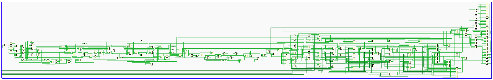
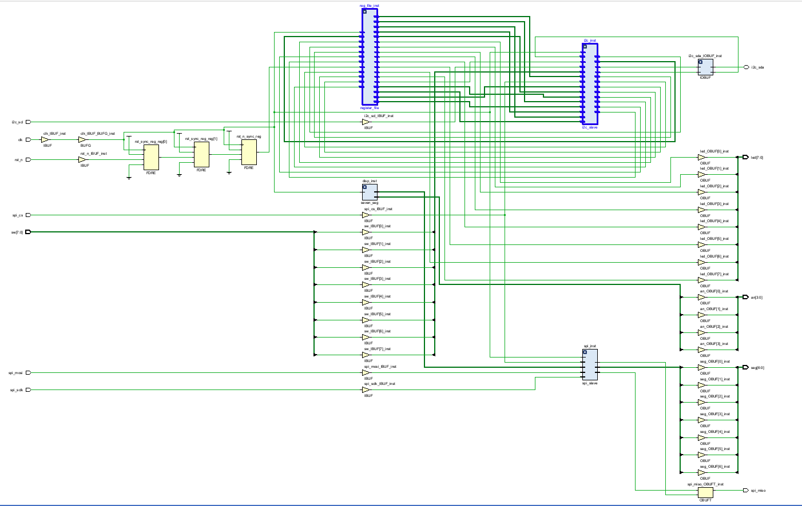
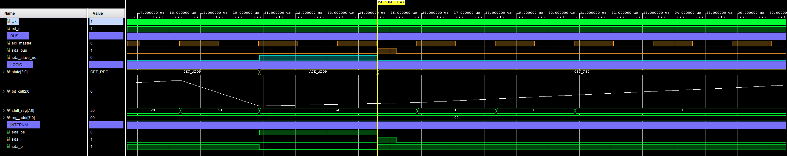

# I2C Control Plane Validation Report
__Protocol:__ I2C Slave (7'b addressing) <br>
__Module:__ [i2c_slave.sv](fpga/src/i2c_slave.sv) <br>
__Version:__ 1.0 <br>
__Date:__ 01/19/2026 <br>
__Author:__ Trey Parker

## __Validation Stages Overview__
| Stage | Description | Status | Date |
|-------|-------------|--------|------|
| 1 | Simulation - Independent I2C Testbench | PASS | 01/19/2026 |
| 2 | Hardware - Logic Analyzer Verification | Pending | - |
| 3 | Integration - Concurrent I2C + SPI | Pending | - |

## __Stage 1: Simulation Verification__

### __1.1 Test Environment__
| - | Details |
|---|---------|
| Simulator | Vivado 2025.2 Simulator |
| Testbench | [tb_i2c_slave.sv](fpga/sim/tb_i2c_slave.sv) |
| DUT | [i2c_slave.sv](fpga/src/i2c_slave.sv) + [register_file.sv](fpga/src/register_file.sv) |
| Clock | 100MHz |
| I2C Speed | Simulated 400kHz Fast Mode |
| Slave Address | 0x50 (7'b) |

#### 1.1.1 DUT Overview (Synthesis)

__I2C Schematic:__ <br>



__Top Schematic:__ <br>


Note: I2C and Register File blocks are highlighted. <br>

#### 1.1.2 Synthesis Resource Utilization (Post-Implementation)
| Resource | Utilization | % Utilized |
|---|---|---|
| LUT | 139 | 0.67% |
| FF  | 178 | 0.43% |
| BRAM | 0 | 0% |
| IO  | 35 | 33.02% |
| BUFG | 1 | 3.13% |

*Note: low utilization expected. Zero BRAM usage confirms Register File implemented in Distributed RAM (LUTs). *

#### 1.1.3 Timing Summary
| Constraint | Target Period | Actual Delay | Slack (WNS) | Result |
|---|---|---|---|---|
| sys_clk | 10.000 ns | 4.966 ns | +5.034 ns | PASS |
| Hold Time | N/A | N/A | +0.156 ns | PASS |
| Pulse Width | 4.500 ns | - | +4.500 ns | PASS |

**Timing Analysis:**
* **Setup Timing:** The design meets the 100 MHz (10ns) requirement with a 50% margin. The critical path delay is only ~4.97ns, indicating low logic depth.
* **Hold Timing:** Positive Worst Hold Slack (+0.156 ns) confirms no race conditions between flip-flops.
* **Status:** Timing Clean (0 Failing Endpoints).

### __1.2 Test Coverage__
| Test ID | Catagory | Description | Expected | Actual | Result |
|---------|----------|-------------|----------|--------|--------|
| 0 | Timing | reg_addr capture before read | 'latched' in GET_REG | 0xA7 | PASS |
| 1 | Read | DEVICE_ID (0x00) | 0x01 | 0x01 | PASS |
| 2 | Read | VERSION_MAJ (0x01) | 0x01 | 0x01 | PASS |
| 3 | Read | VERSION_MIN (0x00) | 0x00 | 0x00 | PASS |
| 4 | R/W | SCRATCH0 (0x05) - Pattern 0x55 | 0x55 | 0x55 | PASS |
| 5 | R/W | SCRATCH0 (0x05) - Pattern 0xAA | 0xAA | 0xAA | PASS |
| 6 | R/W | SCRATCH1 (0x06) - Pattern 0x12 | 0x12 | 0x12 | PASS |
| 7 | Read | LINK_CAPS(0x10) | 0x15 | 0x15 | PASS |
| 8 | Write | LED_OUT (0x20) - HW output | 0xF0 on led[7:0] | 0xF0 | PASS |
| 9 | Read | LED_OUT (0x20) - Readback | 0xF0 | 0xF0 | PASS |
| 10 | Read | SW_IN (0x22) - Input Sample | 0x3C | 0x3C | PASS |
| 11 | Address | Wrong slave address (0x27) | NACK | NACK | PASS |

__Total: 12/12 PASS__ <br>

### __1.3 Bugs Found & Solutions__

#### Bug #1: ACK Timing Race Condition
__Severity:__ Critical <br>
__Symptom:__ Master observed NACK intead of ACK during address phase <br>
__Discovery:__ Test 1 (Read DEVICE_ID) initially failed <br>
__Root Cause Analysis:__ the state machine transitioned out of `ACK_ADDR` on the same SCL falling edge where ACK was being drived. This created a race where `sda_oe` was desasserted before the master could sample SDA.

__Solution:__ Added `ack_scl_rose` flag to track whent the master has sampled the ACK bit: <br>

```systemverilog
// In ACK_ADDR, ACK_REG, ACK_WRITE states:
if (scl_rising && !ack_scl_rose) begin
    ack_scl_rose <= 1'b1;  // Mark: master has sampled our ACK
end

// Only transition on falling edge AFTER rising edge seen:
if (scl_falling && ack_scl_rose) begin
    state <= next_state;
    ack_scl_rose <= 1'b0;  // Reset for next ACK cycle
end
```

__Verification:__ <br>



```log
[22105000] ACK_OUTPUT: state=ACK_ADDR scl_edge=FALL sda_o=0 sda_oe=1 ack_scl_rose=0
[23355000] ACK_ADDR: Saw 9th clock (ACK) rising edge
[23950000] ACK DEBUG: state=ACK_ADDR, sda_slave_oe=1, sda_slave(sda_o)=0, sda_bus=0
[24605000] ACK_OUTPUT: state=ACK_ADDR scl_edge=FALL sda_o=0 sda_oe=1 ack_scl_rose=1
```

The sequence confirms: ACK held through rising edge -> `ack_clk_rose` set -> transition on next falling edge. <br>

#### Bug #2: Register Address Capture timing
__Severity:__ High <br>
__Symptom:__ Read returned data from wrong register (previous reg_addr) <br>
__Discovery:__ Test 0 (reg_addr timing check) <br>
__Root Cause Analysis:__ Initial draft of the i2c slave HDL updated `reg_addr` in `ACK_REG` state after the read strobe was already issued. For read transactions, the register file was queried with stale address. <br>

__Solution:__ Capture `reg_addr` from `shift_reg` at the end of `GET_REG` state (bit 7 captured): <br>

``` systemverilog
GET_REG: begin
    ack_scl_rose    <= 1'b0;    // Reset for upcoming ACK
    if (scl_rising) begin
        shift_reg <= {shift_reg[6:0], sda};
        bit_cnt   <= bit_cnt + 1'b1;
                            
        if (bit_cnt == 3'd7) begin
            reg_addr_r <= {shift_reg[6:0], sda};
            $display("[%0t] GET_REG: Captured reg_addr=0x%02X", $time, {shift_reg[6:0], sda});
        end
    end
end
```

__Verification:__ <br>


```log
[1169175000] === STATE: GET_REG (bit_cnt=0, ack_scl_rose=0, reg_addr=0x20, tx_data=0x00) ===
[1187925000] GET_REG: Captured reg_addr=0x22
[1187925000] === STATE: ACK_REG (bit_cnt=0, ack_scl_rose=0, reg_addr=0x22, tx_data=0x00) ===
[1189175000] ACK_OUTPUT: state=ACK_REG scl_edge=FALL sda_o=0 sda_oe=1 ack_scl_rose=0
```
`reg_addr` is fvalidated before next state.

#### Bug #3: `tx_data` Loading for Read Transactions
__Severity:__ High <br>
__Symptom:__ First byte of read transaction returned 0x00 <br>
__Discovery:__ Test 1 (Read DEVICE_ID) <br>
__Root Cause Analysis:__ For read transactions (R/W = 1), `tx_data` must be loaded from the register file before entering `READ_DATA` state. Original design loaded `tx_data` too late-after the first bit was being shifted out<br>

__Solution:__ Load `tx_data` on the falling edgte transition from `ACK_ADDR` when R/W indicates read: <br>

```systemverilog
ACK_ADDR: begin
    // Track the ACK clock (9th clock) rising edge
    if (scl_rising) begin
        ack_scl_rose    <= 1'b1;
        $display("[%0t] ACK_ADDR: Saw 9th clock (ACK) rising edge", $time);
    end
    if (scl_falling && ack_scl_rose) begin
        bit_cnt         <= 3'd0;
        ack_scl_rose    <= 1'b0;
        // Pre-load tx_data for reads BEFORE entering READ_DATA
        if (rw_bit) begin
            tx_data <= reg_rdata;
            $display("[%0t] ACK_ADDR: Loading tx_data=0x%02X for read", $time, reg_rdata);
        end
    end
end
```

__Verification:__ <br>


```log
[123975000] ACK_ADDR: Loading tx_data=0xa7 for read
[123975000] ACK_OUTPUT: state=ACK_ADDR scl_edge=FALL sda_o=0 sda_oe=1 ack_scl_rose=1
[123975000] === STATE: READ_DATA (bit_cnt=0, ack_scl_rose=0, reg_addr=0x00, tx_data=0xa7) ===
```

DEVICE_ID (0xA7) correctly loaded before READ_DATA state. <br>

### __1.4 State Machine Validation__
All 9 states visited and verified: <br>

```log
[0] === STATE: IDLE (bit_cnt=0, ack_scl_rose=0, reg_addr=0x00, tx_data=0x00) ===

[1475000] === STATE: GET_ADDR (bit_cnt=0, ack_scl_rose=0, reg_addr=0x00, tx_data=0x00) ===

[20855000] === STATE: ACK_ADDR (bit_cnt=0, ack_scl_rose=0, reg_addr=0x00, tx_data=0x00) ===
[22105000] ACK_OUTPUT: state=ACK_ADDR scl_edge=FALL sda_o=0 sda_oe=1 ack_scl_rose=0
[23355000] ACK_ADDR: Saw 9th clock (ACK) rising edge
[23355000] ACK_OUTPUT: state=ACK_ADDR scl_edge=RISE sda_o=0 sda_oe=1 ack_scl_rose=0
[23950000] ACK DEBUG: state=ACK_ADDR, sda_slave_oe=1, sda_slave(sda_o)=0, sda_bus=0
[24605000] ACK_OUTPUT: state=ACK_ADDR scl_edge=FALL sda_o=0 sda_oe=1 ack_scl_rose=1

[24605000] === STATE: GET_REG (bit_cnt=0, ack_scl_rose=0, reg_addr=0x00, tx_data=0x00) ===
[43355000] GET_REG: Captured reg_addr=0x00

[43355000] === STATE: ACK_REG (bit_cnt=0, ack_scl_rose=0, reg_addr=0x00, tx_data=0x00) ===
[44605000] ACK_OUTPUT: state=ACK_REG scl_edge=FALL sda_o=0 sda_oe=1 ack_scl_rose=0
[45855000] ACK_REG: Saw ACK clock rising edge
[45855000] ACK_OUTPUT: state=ACK_REG scl_edge=RISE sda_o=0 sda_oe=1 ack_scl_rose=0
[46450000] ACK DEBUG: state=ACK_REG, sda_slave_oe=1, sda_slave(sda_o)=0, sda_bus=0
[47105000] ACK_OUTPUT: state=ACK_REG scl_edge=FALL sda_o=0 sda_oe=1 ack_scl_rose=1

[47105000] === STATE: WRITE_DATA (bit_cnt=0, ack_scl_rose=0, reg_addr=0x00, tx_data=0x00) ===
  PASS: reg_addr correctly captured BEFORE DEVICE_ID read
[48355000] WRITE_DATA: bit[7]=0, shift_reg=0x00

[100855000] === STATE: GET_ADDR (bit_cnt=0, ack_scl_rose=0, reg_addr=0x00, tx_data=0x00) ===

[120225000] === STATE: ACK_ADDR (bit_cnt=0, ack_scl_rose=0, reg_addr=0x00, tx_data=0x00) ===
[121475000] ACK_OUTPUT: state=ACK_ADDR scl_edge=FALL sda_o=0 sda_oe=1 ack_scl_rose=0
[122725000] ACK_ADDR: Saw 9th clock (ACK) rising edge
[122725000] ACK_OUTPUT: state=ACK_ADDR scl_edge=RISE sda_o=0 sda_oe=1 ack_scl_rose=0
[123325000] ACK DEBUG: state=ACK_ADDR, sda_slave_oe=1, sda_slave(sda_o)=0, sda_bus=0
[123975000] ACK_ADDR: Loading tx_data=0xa7 for read
[123975000] ACK_OUTPUT: state=ACK_ADDR scl_edge=FALL sda_o=0 sda_oe=1 ack_scl_rose=1

[123975000] === STATE: READ_DATA (bit_cnt=0, ack_scl_rose=0, reg_addr=0x00, tx_data=0xa7) ===
[126475000] READ_DATA: Shifted out bit, tx_data now=0x4e, bit_cnt=1
[128975000] READ_DATA: Shifted out bit, tx_data now=0x9c, bit_cnt=2
[131475000] READ_DATA: Shifted out bit, tx_data now=0x38, bit_cnt=3
[133975000] READ_DATA: Shifted out bit, tx_data now=0x70, bit_cnt=4
[136475000] READ_DATA: Shifted out bit, tx_data now=0xe0, bit_cnt=5
[138975000] READ_DATA: Shifted out bit, tx_data now=0xc0, bit_cnt=6
[141475000] READ_DATA: Shifted out bit, tx_data now=0x80, bit_cnt=7
[143975000] READ_DATA: Shifted out bit, tx_data now=0x00, bit_cnt=8

[143975000] === STATE: WAIT_ACK (bit_cnt=0, ack_scl_rose=0, reg_addr=0x00, tx_data=0x00) ===
[145225000] WAIT_ACK: Master NACK, ending read

[145225000] === STATE: IDLE (bit_cnt=0, ack_scl_rose=0, reg_addr=0x00, tx_data=0x00) ===
[151450000] I2C Read: Reg[0x00] = 0xa7
```

## __Stage 2: Hardware Validation__
