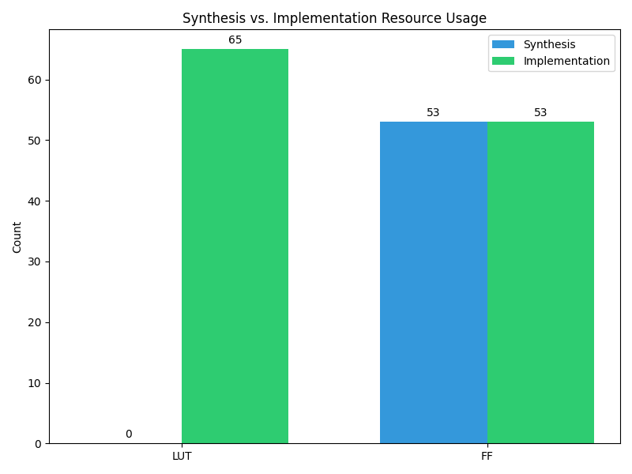

# FPGA Phase Comparison Report
**Project:** STM32-FPGA Bridge (Basys 3)  

## 1. Timing Comparison
| Metric | Synthesis (Est.) | Implementation (Real) | Delta |
| :--- | :--- | :--- | :--- |
| **WNS (Slack)** | 5.817 ns [MET] | 5.242 ns [MET] | -0.58 ns |
| **Max Frequency** | - | 210.17 MHz | - |

## 2. Resource Comparison
| Resource | Synthesis Count | Implementation Count | Difference |
| :--- | :--- | :--- | :--- |
| **LUTs** | 0 | 65 | 65 |
| **Registers** | 53 | 53 | 0 |

    