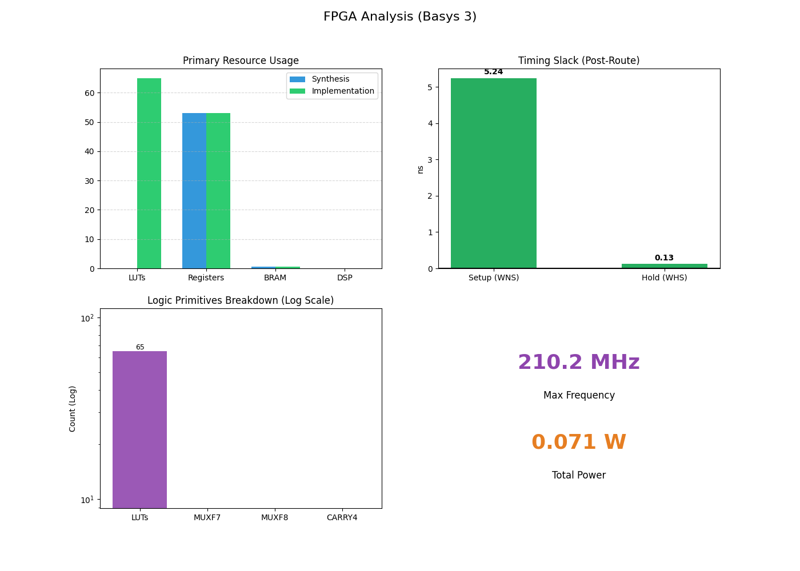

# FPGA Design Report
**Device:** XC7A35T (Basys 3)

## 1. High-Level Metrics
| Metric | Value | Status |
| :--- | :--- | :--- |
| **Max Frequency** | **210.2 MHz** | - |
| **Setup Slack** | 5.242 ns | [PASS] |
| **Hold Slack** | 0.127 ns | [PASS] |
| **Power** | 0.071 W | - |

## 2. Resource Utilization
| Resource | Synth | Impl | Limit | Utilization |
| :--- | :--- | :--- | :--- | :--- |
| **LUT** | 0 | 65 | 20800 | 0.3% |
| **FF** | 53 | 53 | 41600 | 0.1% |
| **BRAM** | 0.5 | 0.5 | 50 | 1.0% |
| **DSP** | 0 | 0 | 90 | 0.0% |

## 3. Logic Primitives Breakdown
This section details specific hardware primitives used (Hardware-level analysis).

| Primitive | Count | Purpose |
| :--- | :--- | :--- |
| **MUXF7** | 0 | Used to combine 2 LUTs (for 5-8 input functions). |
| **MUXF8** | 0 | Used to combine 2 MUXF7s (for larger muxes). |
| **CARRY4** | 0 | Dedicated Fast Carry Logic for adders/counters. |

    