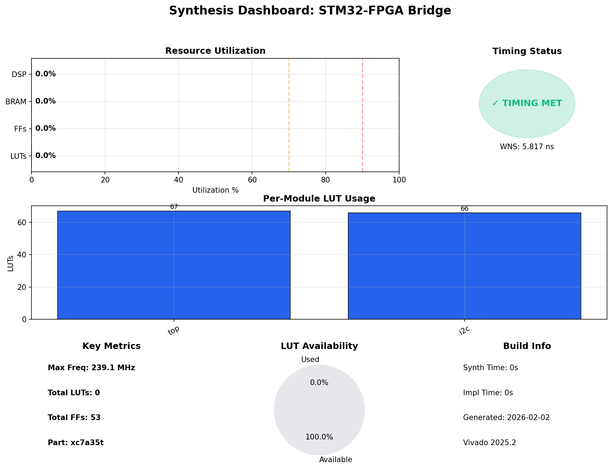
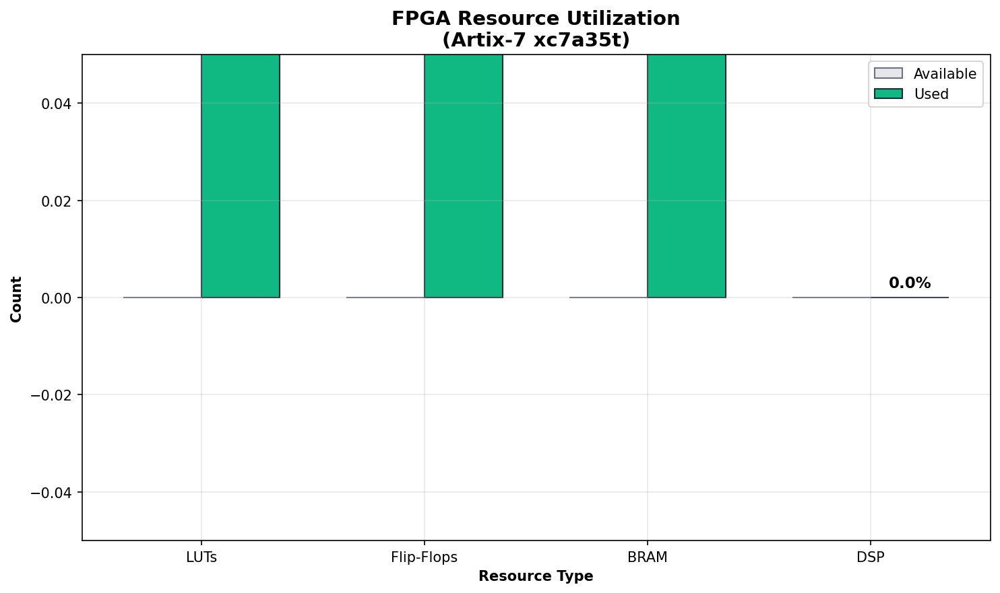
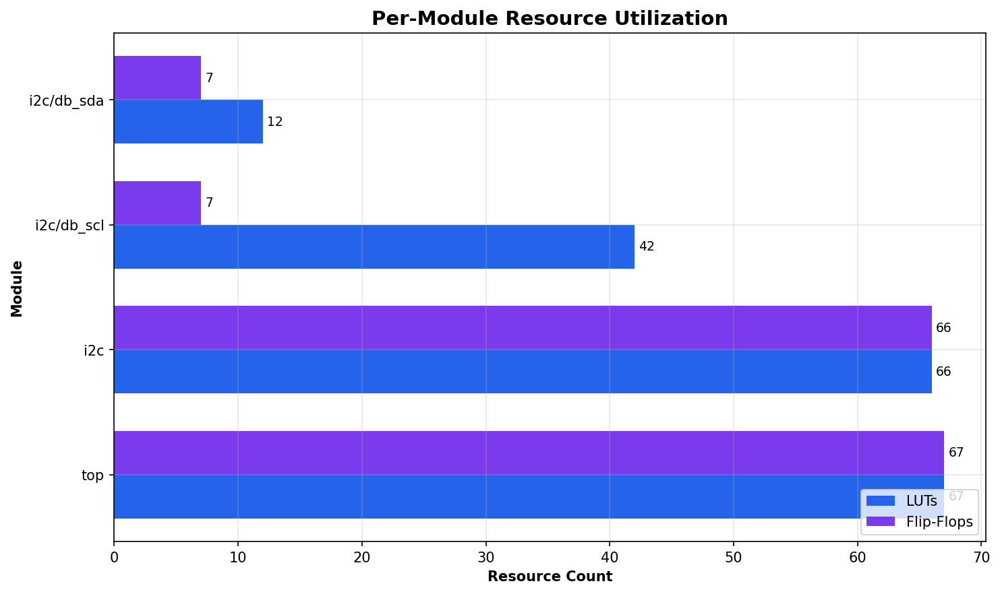
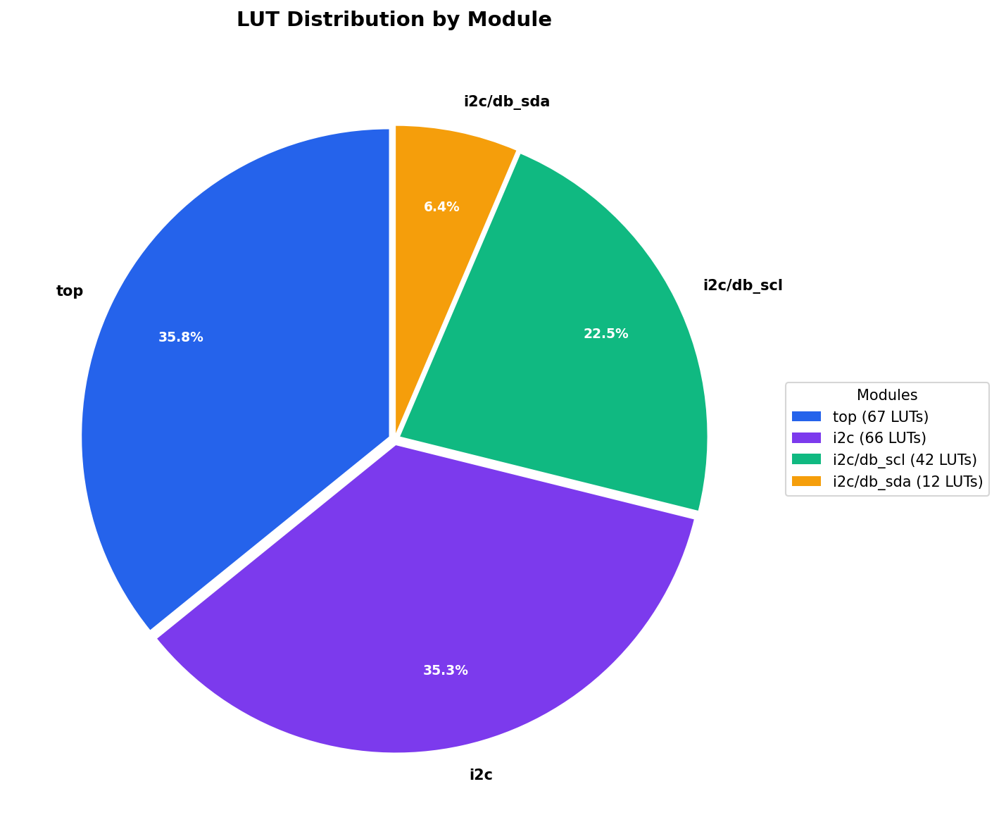
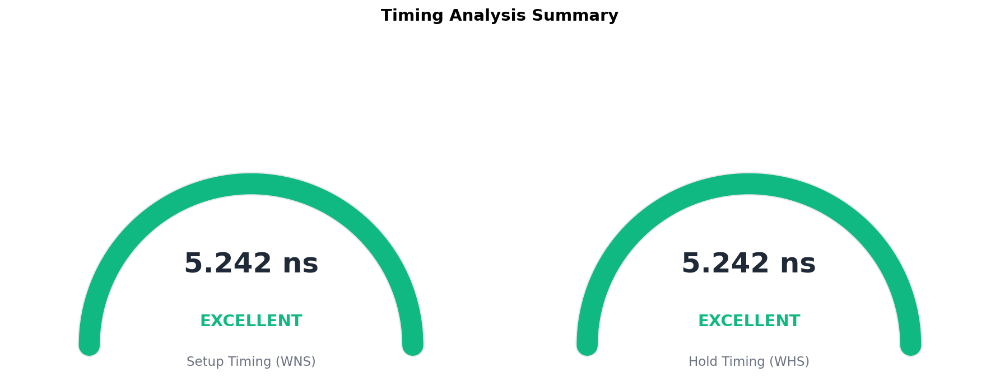

# Synthesis & Implementation Report

**Project:** STM32-FPGA Bridge  
**Target Device:** xc7a35tcpg236-1 (Basys 3)  
**Top Module:** top  
**Generated:** 2026-02-02 10:11:37

---

## Dashboard

---

## Quick Summary

| Metric | Value | Status |
|--------|-------|--------|
| **LUT Utilization** | 0 / 20,800 (0.0%) | ✅ |
| **FF Utilization** | 53 / 0 (0.0%) | ✅ |
| **BRAM** | 0.5 / 0 | ✅ |
| **DSP** | 0 / 0 | ✅ |
| **Timing (Setup)** | WNS = 5.817 ns | ✅ Met |
| **Max Frequency** | 239.1 MHz | ✅ |

## Resource Utilization

### Detailed Breakdown

| Resource | Used | Available | Utilization |
|----------|------|-----------|-------------|
| Slice LUTs | 0 | 20,800 | `░░░░░░░░░░░░░░░░░░░░` 0.0% |
| Slice FFs | 53 | 0 | `░░░░░░░░░░░░░░░░░░░░` 0.0% |
| Block RAM | 0.5 | 0 | `░░░░░░░░░░░░░░░░░░░░` 0.0% |
| DSP48 | 0 | 0 | `░░░░░░░░░░░░░░░░░░░░` 0.0% |

## Per-Module Breakdown

### Resource Table

| Module | LUTs | FFs | BRAM | DSP |
|--------|------|-----|------|-----|
| `top` | 67 | 67 | 0.0 | 0 |
| `i2c_inst` | 66 | 66 | 0.0 | 0 |

## Timing Analysis

### Summary

| Metric | Value |
|--------|-------|
| **WNS (Setup)** | 5.817 ns |
| **TNS** | 0.000 ns |
| **WHS (Hold)** | 5.817 ns |
| **Max Frequency** | 239.1 MHz |

**Status:** ✅ All timing constraints met

## Recommendations

- ✅ **Excellent efficiency** - ~90% resources available for Core IP
- ✅ **Strong timing margin** - 5.8 ns slack

---

**Charts Generated:**
- `charts/dashboard.png` - Combined metrics
- `charts/utilization_bars.png` - Resource utilization
- `charts/module_bars.png` - Per-module breakdown
- `charts/module_pie.png` - LUT distribution
- `charts/timing_chart.png` - Timing gauges

*Generated: 2026-02-02 10:11:37*
